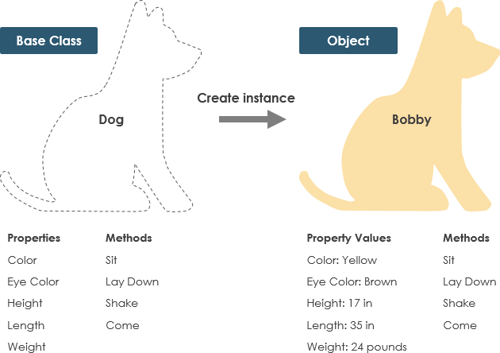

# tech201_oop


## Object Oriented Programming (OOP)

### What is OOP?
- Object-oriented programming (OOP) is a style of programming characterized by the identification of classes of objects closely linked with the methods (functions) with which they are associated. It also includes ideas of inheritance of attributes and methods.


### OOP diagram example




### The four pillars of OOP
- Abstraction - In simple terms, abstraction “displays” only the relevant attributes of objects and “hides” the unnecessary details. For example, when we are driving a car, we are only concerned about driving the car like start/stop the car, accelerate/ break, etc.
- The abstract method in the example below is the `drive` method:
```
from abc import abstractmethod, ABC

class Vehicle(ABC):
    def __init__(self, speed, year):
        self.speed = speed
        self.year = year

    def start(self):
        print("Starting engine")

    def stop(self):
        print("Stopping engine")

    @abstractmethod
    def drive(self):
        pass


class Car(Vehicle):
    def __init__(self, canClimbMountains, speed, year):
        Vehicle.__init__(self, speed, year)
        self.canClimbMountains = canClimbMountains

    def drive(self):
        print("Car is in drive mode")
```

- Polymorphism - Polymorphism means the ability to take various forms. In OOP, forms can be considered as behaviors. In Python, an object has different types of behaviors based on data and inputs through polymorphism. Method overriding is also a kind of polymorphism.
- In the below example, the `+` operator act as an addition between two integers and concatenation between strings. This is how polymorphism works in Python:
```
num1 = 1
num2 = 2
print(num1 + num2) # OutPut: 3

str1 = "This is"
Str2 = "Python"
print(str1+str2) # OutPut : This is Python
```
- Encapsulation - Encapsulation is a process of protecting the data and functionality of a class in a single unit, called an object. This mechanism is often used to protect the data of an object from other objects. It’s one of the fundamental principles in any programming language that supports object-oriented programming.
- Below is an example of encapsulation:
```

class House:
  
  def __init__(self, wallDynamic):
    self.__wall = wallDynamic
```
- Inheritance - Inheritance is a powerful feature in object-oriented programming. It is the process of creating a class that can derive or inherit the properties and methods from another class(parent/base).
- We can represent real-world relationships easily with this feature. The reusability of the code will be simple. It has a powerful transitive nature — meaning when class B inherited from class A, then the classes that inherited from class B will automatically be inherited from class A.
```
class Vehicle:
    def __init__(self, maxSpeed, year):
        self.maxSpeed = maxSpeed
        self.year = year

    def startEngine(self):
        print("Start Engine")

    def stopEngine(self):
        print("Stop Engine")


class Bus(Vehicle):
    def __init__(self):
        Vehicle.__init__(self, 100, 1980)

    def startingBusEngine(self):
        self.startEngine()


class Car(Vehicle):
    def __init__(self):
        Vehicle.__init__(self, 200, 1990)

    def stopCarEngine(self):
        self.stopCarEngine()
```

### What are the benefits of OOP?
- Easy troubleshooting
- Polymorphism Flexibility
- Re-usability
- Code Maintenance

### What are lambda functions?
- A lambda function is an anonymous function (i.e., defined without a name) that can take any number of arguments but, unlike normal functions, evaluates and returns only one expression.

### Where is lambda useful?
- Lambda functions are intended as a shorthand for defining functions that can come in handy to write concise code without wasting multiple lines defining a function. They are also known as anonymous functions, since they do not have a name unless assigned one.

